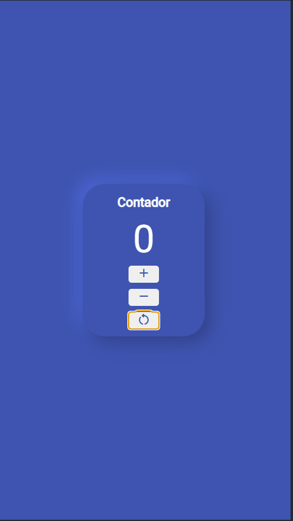

## **Nombre: Counter.**

Descripción: Este proyecto es como una especie de recto, el  cual consiste en un contandor que avanza o disminuye según sea presionado el boton respectivamente, tambien cuenta con un boton se reset que iguala el contador a cero, este proyecto esta basado en html, css y javascript puro.

### Capturas

| Mobile                   | Desktop                   |
| ------------------------ | ------------------------- |
|  |  |

### Links

- Solución
https://cyeguez.github.io/Contador/

### Proceso de desarrollo

El proyecto lo arranque haciendo mi repositorio, estructure el proyecto en html y le di los estilos que crei comvenientes, comencé con mobile fist, cree una mediaquiery para que se adaptara al tamano de desktop, para ser sincero queria llegar a la parte de javascript, queria practica el manejo de los elementos del dom, y como implementar la lógica; luego una vez terminada la logica del proyecto me enfoque en darle sombras y mejorar lo visual.
### Contruido con

<!-- ul -->

- HTML Semantico.
- CSS vainilla.
- flex-box.
- Diseño mobile.
- JavaScript.

## Autor

- Nombre: Cesar Yeguez
- GibHub - [@cyeguez](https://github.com/cyeguez)
- Frontend Mentor -[@cyeguez](https://www.frontendmentor.io/profile/cyeguez)
